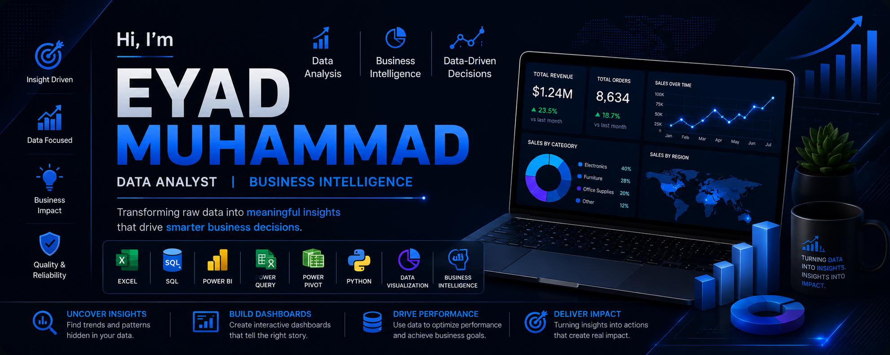

# <div align="center">



# Hi 👋 I'm Eyad Muhammad

### **Data Analyst | Business Intelligence | Turning Data into Business Value**

<p>


</p>

</div>

---

# 🚀 About Me

💡 I'm a **Data Analyst** passionate about transforming raw data into actionable insights that drive business growth and smarter decision-making.

📊 Skilled in **Data Analytics, Business Intelligence, SQL, Python, Excel, Power BI, Power Query, Power Pivot, Data Visualization, and Data Modeling**.

🎓 Studied **Business Information Systems (BIS)**, combining business knowledge with analytical thinking to solve real-world business challenges.

📈 I specialize in building interactive dashboards, automating reports, designing efficient data models, and uncovering insights that help organizations optimize performance.

🌱 Continuously expanding my expertise in **Machine Learning, Microsoft Fabric, Cloud Analytics, and Modern BI Technologies**.

🎯 My mission is to transform complex data into clear, measurable business value.

---

# 💻 Tech Stack

### 📊 Analytics & BI

<p>


</p>

<p>


</p>

---

# 🚀 What I Do

✔ Transform Raw Data into Business Insights

✔ Design Executive & Interactive Dashboards

✔ Analyze Business Performance

✔ Build KPI Reporting Solutions

✔ Clean & Transform Data (ETL)

✔ Develop Data Models

✔ Automate Reports

✔ Support Data-Driven Decision Making

---

# 💼 Services

📊 Business Intelligence Dashboards

📈 Sales & Marketing Analytics

📉 KPI Reporting

📦 Excel Automation

⚡ Power Query Solutions

🗄 SQL Database Analysis

📊 Data Cleaning & Transformation

📋 Business Reporting

---

# 📊 Core Expertise

```text
Business Intelligence     ███████████████████░ 95%
Power BI                  ██████████████████░░ 90%
Excel                     ██████████████████░░ 90%
SQL                       ██████████████████░░ 90%
Data Visualization        ██████████████████░░ 90%
Power Query               █████████████████░░░ 88%
Power Pivot               █████████████████░░░ 88%
Python                    ███████████████░░░░░ 80%
Machine Learning          ███████████░░░░░░░░░ 60%
```

---

# 🎯 My Analytics Workflow

```text
Business Problem
        │
        ▼
Collect Data
        │
        ▼
Clean & Transform
        │
        ▼
Data Modeling
        │
        ▼
Analysis
        │
        ▼
Visualization
        │
        ▼
Business Insights
        │
        ▼
Decision Making
```

---

# 📌 Featured Projects

### 📊 Sales Performance Dashboard

Interactive Power BI dashboard featuring executive KPIs, DAX measures, and a star schema data model for sales performance analysis.

### 📈 Business Intelligence Dashboard

Comprehensive dashboard delivering actionable insights through advanced visualizations and performance metrics.

### 🐍 Python Data Analysis

Automated data cleaning, transformation, and exploratory analysis using Python and Pandas.

### 📊 Excel Analytics

Professional dashboards built with Power Query, Power Pivot, PivotTables, and advanced Excel formulas.

---

# 🌱 Currently Learning

* Microsoft Fabric
* Machine Learning
* Advanced SQL Optimization
* Cloud Data Analytics
* Data Engineering Fundamentals

---

# 📈 GitHub Activity

<p align="center">


</p>

<p align="center">


</p>

---

# 🌍 Connect With Me

<p align="left">

<a href="https://linkedin.com/in/ed-mo1">

</a>

<a href="mailto:eyadmuhammad90@gmail.com">

</a>

<a href="https://github.com/Ed-Mo1">

</a>

</p>

---

<div align="center">

### ⭐ *"Transforming Data into Decisions, and Decisions into Business Success."*

Thanks for visiting my profile! Feel free to explore my repositories, and don't hesitate to connect if you'd like to collaborate on data-driven projects.

</div>
